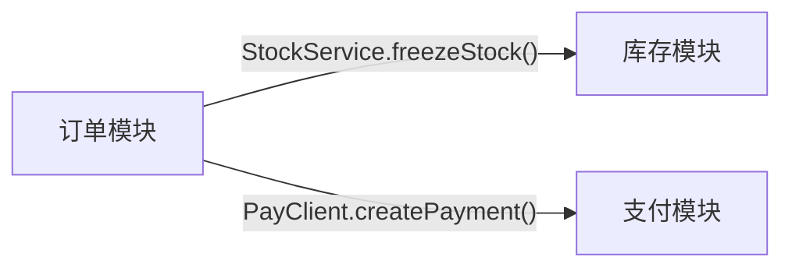

# 依赖分析规则

依赖关系必须基于源码调用或 analyzer 产物确认，不能仅根据 `pom.xml` 推断。`pom.xml` 只能说明构建期可见性或物理 Maven 结构，不能单独作为业务依赖证据。

## 1. 证据优先级

按以下顺序确认依赖：

1. `dependencies.json.component_dependencies` 与 `dependencies.json.module_dependencies`。
2. `components/*.json.methods[].calls[]` 中的 `resolved_component`、`target`、`line`、`snippet`。
3. `components/*.json.fields[]` 中的注入字段、远程客户端字段和配置字段。
4. 源码中的 `import`、构造器注入、字段注入、方法调用。
5. `pom.xml`，仅作为 Maven 模块结构和构建依赖背景。

如果只有 `pom.xml` 证据，文档中只能写“构建层面存在依赖”，不能写成“业务流程调用”。

## 2. 源码检索

当 analyzer 产物不足以解释依赖时，使用 `rg` 补充检索源码：

```bash
rg "import .*Service|import .*Client|import .*Facade" <repo-or-module-path>
rg "class .*Service|interface .*Client|interface .*Facade" <repo-or-module-path>
rg "<serviceField>\\." <repo-or-module-path>
rg "@Autowired|@Resource|@Inject|final .*Service|final .*Client" <repo-or-module-path>
```

检索结果必须回到具体类、字段或方法调用。不要只因为存在 import 就断言业务调用；import 只能作为继续追踪的线索。

## 3. 依赖描述粒度

模块依赖描述必须尽量细化到：

```text
调用模块 -> 被调模块 -> 服务类 -> 具体方法 -> 调用目的 -> 证据位置
```

示例：

```text
订单模块 -> 库存模块 -> StockService -> freezeStock() -> 下单前冻结库存 -> OrderService.java:L88-L104
```

如果只能确认类级依赖，明确写“未定位到具体方法调用”。如果只能确认 Maven 依赖，明确写“仅构建依赖，未确认运行时调用”。

## 4. Mermaid 依赖图

模块依赖章节应使用 Mermaid `graph TB` 或 `graph LR` 可视化关键依赖：



图中的边要优先标注服务类和方法名，而不是只写“依赖”。

## 5. 反模式

不允许：

- 只根据 `pom.xml` 写“模块 A 调用模块 B”。
- 只列 Maven artifactId，不说明实际业务调用。
- 把依赖写成泛泛的“依赖公共服务”“调用基础模块”。
- 没有服务类、方法或证据位置的跨模块业务流。
