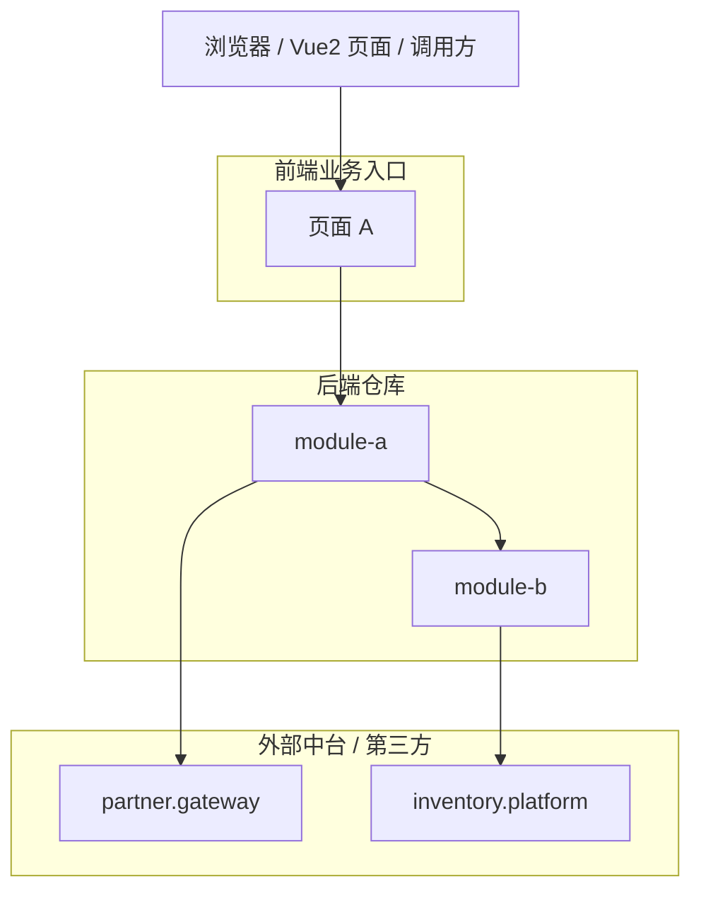

# 仓库总览模板

所有模块文档完成后生成 `overview.md`。仓库总览用于建立导航和系统级理解，不替代模块文档。当前后端分析产物与前端分析产物同时存在时，`overview.md` 是一份融合业务系统总览，不是后端仓库总览和前端仓库总览的拼接。

生成 `overview.md` 前必须确认所有 `processing_order.json.steps[].module_id` 对应的模块文档已经生成。不得只生成 `overview.md`，也不得把 `overview.md` 当作模块文档的汇总替代品。

## 推荐结构

```markdown
# 业务系统名称

## 1. 项目概述

说明业务系统用途、主要用户、系统边界和核心能力。若同时提供前后端仓库，说明二者在同一业务系统中的分工，而不是分别介绍两个仓库。

## 2. 核心业务流程

优先总结 2-4 条最能帮助开发人员上手的端到端业务流程。存在前端 analysis 时，从 `matched_flows` 中挑选；没有前端 analysis 时，从重要后端入口中挑选。

每条流程包含：

- 业务目的。
- 触发入口（前端页面/按钮/生命周期，或后端定时任务/消息/接口）。
- 后端承接模块和关键服务方法。
- 外部系统调用（如有）。
- 一张 Mermaid `sequenceDiagram` 或 `flowchart TD`。
- 指向对应模块文档的链接。
- 关键证据：入口、调用链、前端触发点或源码行号；证据不足时写“当前源码未确认”，不得补全为确定流程。

不要在本节输出完整接口清单或参数表。

## 3. 前后端调用链路

仅在提供 Vue2 前端分析产物时生成本节。

- 根据前端 `module_tree.json` 和 `page_index.json` 按业务模块列出页面；表格列：业务模块 / 页面标题 / bizId / 入口组件 / 主要触发点。
- 根据 `page_flows.json` 摘要 3-8 个核心页面流程；优先选择 `confidence = high` 且已匹配后端接口的流程。
- 根据 `backend_api_usage.json` 统计前端调用的后端接口数量、已匹配数量、未匹配数量。
- 未匹配后端接口只列与业务流程相关的典型项：页面 / 触发点 / HTTP / 路径 / API 函数 / 未对齐原因 / 证据 / 待确认点。不要输出完整 API 清单。

没有前端产物时写：本次未提供前端分析产物，无法从页面视角还原业务调用顺序。

## 4. 业务模块结构

根据后端 `module_tree.json` 列出文档模块；表格列：模块名 / 简介 / 文档链接。

如果叶子模块总数 <= 8（扁平结构）：链接直接指向 `docs/<module>.md`。
否则：链接指向顶层父模块文档，再由父模块文档继续导航到子模块。

## 5. 模块依赖关系

按 [dependency-analysis-rules.md](dependency-analysis-rules.md) 总结模块依赖。依赖关系必须基于源码调用或 analyzer 产物，不要仅根据 `pom.xml` 推断。

依赖描述粒度尽量达到：调用模块 -> 被调模块 -> 服务类 -> 方法 -> 调用目的。必须配 Mermaid `graph LR` 或 `graph TB`。

## 6. 系统架构



- 节点：前端页面或前端业务模块 + 顶层后端文档模块 + 外部系统。
- 后端内部边：`dependencies.json.module_dependencies`。
- 外部系统边：`external_module_dependencies` 或 `modules/*.json.external_systems`。
- 前端到后端边：`backend_api_usage.json` 匹配后端 `entry_points` 后得到。
- **外部系统节点必须出现**：只要存在远程调用，就要画出去向外部的边。

## 5.X 前后端对齐总览（仅当存在前端 analysis 时输出）

- **对齐统计**：表格列 `matched_flows` 总数 / `frontend_only_flows` 总数 / `backend_only_endpoints` 总数。
- **对齐方式分布**：exact / placeholder_normalized / suffix_match 三类各占比；若 suffix_match 数量较多，提示用户确认网关前缀。
- **典型未对齐流程**：从 `frontend_only_flows` 与 `backend_only_endpoints.important` 各列 3-5 条最有代表性的（页面名 / endpoint 路径 / 未对齐原因 / 证据 / 待确认点），让读者快速看到"前后端不一致"区域。不得把未对齐原因写成确定业务结论。

## 7. 外部系统集成

- **远程依赖清单**：表格列 外部系统 / 调用模块 / 用途。数据源为 `modules/*.json.external_systems` 与 `dependencies.json.external_module_dependencies`。
- 其他：MQ producer/consumer、定时任务、对象存储、缓存（若分析产物可见）。
不要输出完整 REST 入口清单；只列和核心业务流程、外部集成或维护风险相关的入口。

## 8. 文档导航

列出所有模块文档链接（按业务域排序）。
若有前端产物，可增加“页面到后端模块”导航表：页面标题 / 前端模块 / 主要后端模块 / 文档链接。

## 9. 分析说明

- 后端 analyzer 诊断（含 `remote_url_unresolved`）。
- 前端 analyzer 诊断（含 `page_entry_not_found`、动态 API path、未匹配接口）。
- 跳过文件。
- 模型聚合边界与未确认区域。
- 模块划分限制。
- Schema 版本信息（若后端 schema < 1.1 必须说明远程信息可能不完整）。
```

## 生成规则

- 架构图以顶层文档模块、Maven 模块、前端页面或外部系统为节点。
- **每个外部系统必须在图中可见**（远程调用是这类项目的核心，不可省略）。
- 如果提供前端产物，前端页面或前端业务模块必须作为调用方节点出现。
- 如果同时提供前后端产物，只生成一张融合架构图；不要分别生成“前端架构图”和“后端架构图”作为两个独立系统。
- 每个顶层模块必须有一个主要导航链接。
- 每个模块文档链接必须指向已生成文件；如果链接目标不存在，说明模块文档生成不完整，应先补齐模块文档再完成总览。
- 只概括模块职责，不复制模块文档细节。
- 使用后端 `analysis.json.summary` 说明后端规模（含 `total_remote_endpoints` 与 `total_remote_clients`，若存在）。
- 如果提供前端产物，同时使用前端 `analysis.json.summary` 说明页面数、组件数、API 定义数、页面流程数。
- 使用 `build_system.modules` 说明 Maven 结构，即使文档模块按业务域重新聚合。
- 使用 `dependencies.json.module_dependencies` 说明最终模块依赖方向，`external_module_dependencies` 说明对外部系统的依赖。
- 使用前端 `backend_api_usage.json` 说明页面触发的后端接口调用，不要凭后端 Controller 名称反推前端流程。
- 核心业务流程必须来自已生成模块文档、`matched_flows` 或重要后端入口；不得为了总览完整而新增模块文档中没有证据支持的流程。
- Mermaid 架构图和流程图中的节点、边、外部系统必须能在 artifacts、源码或已生成模块文档中找到依据。
- 不输出交易码列表、完整接口参数表或纯 API 目录。
- 业务规则只有在源码、配置或流程证据明确时才输出；没有证据时不要硬写规则章节。
- 避免宣传式或推测性描述。
- 如果使用了模型聚合，简要说明聚合依据来自 Maven、包名、Spring stereotype、入口和依赖图。
