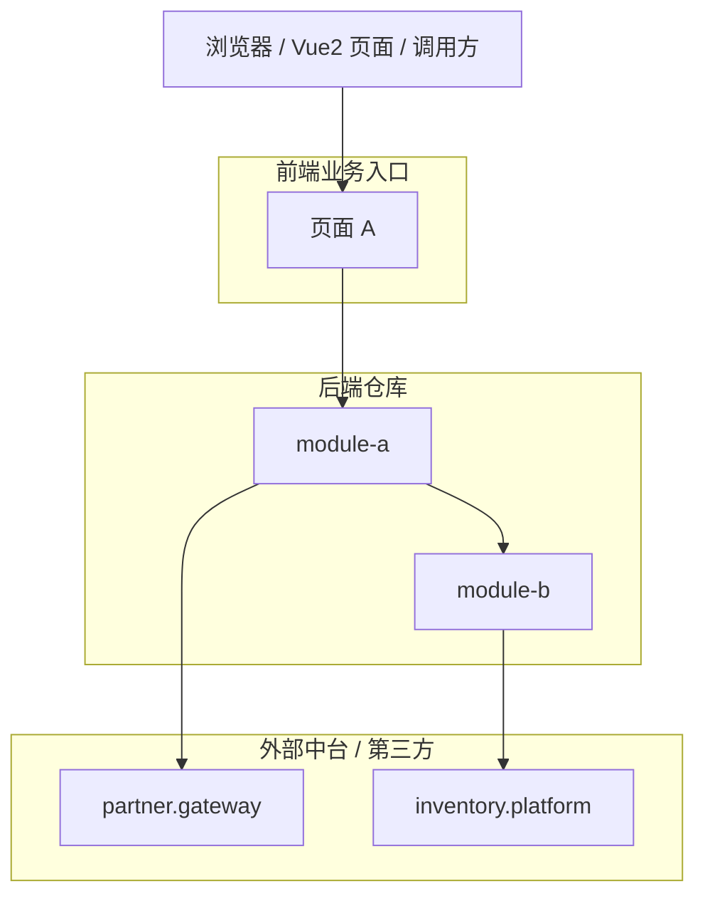

# 仓库总览模板

所有模块文档完成后生成 `overview.md`。仓库总览用于建立导航和系统级理解，不替代模块文档。

## 推荐结构

```markdown
# 仓库名称

## 1. 项目概述

说明仓库用途、主要用户、系统边界和核心能力。1-2 段。

## 2. Maven 结构

根据后端 `analysis.json.build_system.modules` 总结物理 Maven 模块布局；表格列出 module / artifact_id / 路径。

## 3. 前端页面与业务入口

仅在提供 Vue2 前端分析产物时生成本节。

- 根据前端 `module_tree.json` 和 `page_index.json` 按业务模块列出页面；表格列：业务模块 / 页面标题 / bizId / 入口组件 / 主要触发点。
- 根据 `page_flows.json` 摘要 3-8 个核心页面流程；优先选择 `confidence = high` 且已匹配后端接口的流程。
- 根据 `backend_api_usage.json` 统计前端调用的后端接口数量、已匹配数量、未匹配数量。
- 未匹配后端接口必须单独列出：HTTP / 路径 / 页面 / 触发点 / API 函数。

没有前端产物时写：本次未提供前端分析产物，无法从页面视角还原业务调用顺序。

## 4. 文档模块

根据后端 `module_tree.json` 列出文档模块；表格列：模块名 / 简介 / 文档链接。

如果叶子模块总数 <= 8（扁平结构）：链接直接指向 `docs/<module>.md`。
否则：链接指向顶层父模块文档，再由父模块文档继续导航到子模块。

## 5. 系统架构



- 节点：前端页面或前端业务模块 + 顶层后端文档模块 + 外部系统。
- 后端内部边：`dependencies.json.module_dependencies`。
- 外部系统边：`external_module_dependencies` 或 `modules/*.json.external_systems`。
- 前端到后端边：`backend_api_usage.json` 匹配后端 `entry_points` 后得到。
- **外部系统节点必须出现**：只要存在远程调用，就要画出去向外部的边。

## 6. 关键流程

挑选 2-4 个最具代表性的端到端业务流。优先涵盖：

- 前端页面初始化查询。
- 核心提交/写入流程。
- 跨后端模块流程。
- 跨外部系统远程调用流程。

挑选 2-4 个最具代表性的端到端业务流（优先涵盖：登录认证、核心写入流程、关键查询流程、跨模块远程调用流程）。

**当存在前端 analysis 时**：优先从 [frontend-backend-alignment.md](frontend-backend-alignment.md) 产出的 `matched_flows` 中按 `overall_confidence == high` 挑选，每条形成端到端业务路径，sequenceDiagram 参与者为 `User → Page.vue → frontend API → Controller → Service → RemoteClient → External`。

每个流程：

- 一句话说明业务目的（含前端 `page_title` / `bizId`，若存在前端 analysis）。
- 一张 sequenceDiagram，参与者使用模块名或核心 Page / Controller / Service 名，至少含一个外部系统。
- 链接到该流程的详细描述（在对应模块文档的 §4.0「前端业务流程」或 §4「数据流」小节）。

不要重复模块文档中的完整步骤；overview 只画“全景路径”。

## 5.X 前后端对齐总览（仅当存在前端 analysis 时输出）

- **对齐统计**：表格列 `matched_flows` 总数 / `frontend_only_flows` 总数 / `backend_only_endpoints` 总数。
- **对齐方式分布**：exact / placeholder_normalized / suffix_match 三类各占比；若 suffix_match 数量较多，提示用户确认网关前缀。
- **典型未对齐流程**：从 `frontend_only_flows` 与 `backend_only_endpoints.important` 各列 3-5 条最有代表性的（页面名 / endpoint 路径 / 推测原因），让读者快速看到"前后端不一致"区域。

## 6. 入口与外部依赖

- **前端调用入口汇总**：若有前端产物，表格列 页面 / 触发点 / HTTP / 路径 / 后端模块 / 匹配状态。
- **REST 入口汇总**：表格列 HTTP / 路径 / 所在模块 / Controller。数据源为后端 `modules/*.json.entry_points` 全集。
- **远程依赖清单**：表格列 外部系统 / 调用模块 / 用途。数据源为 `modules/*.json.external_systems` 与 `dependencies.json.external_module_dependencies`。
- 其他：MQ producer/consumer、定时任务、对象存储、缓存（若分析产物可见）。

## 8. 文档导航

列出所有模块文档链接（按业务域排序）。
若有前端产物，可增加“页面到后端模块”导航表：页面标题 / 前端模块 / 主要后端模块 / 文档链接。

## 9. 分析说明

- 后端 analyzer 诊断（含 `remote_url_unresolved`）。
- 前端 analyzer 诊断（含 `page_entry_not_found`、动态 API path、未匹配接口）。
- 跳过文件。
- 模型聚合边界与未确认区域。
- 模块划分限制。
- Schema 版本信息（若后端 schema < 1.1 必须说明远程信息可能不完整）。
```

## 生成规则

- 架构图以顶层文档模块、Maven 模块、前端页面或外部系统为节点。
- **每个外部系统必须在图中可见**（远程调用是这类项目的核心，不可省略）。
- 如果提供前端产物，前端页面或前端业务模块必须作为调用方节点出现。
- 每个顶层模块必须有一个主要导航链接。
- 只概括模块职责，不复制模块文档细节。
- 使用后端 `analysis.json.summary` 说明后端规模（含 `total_remote_endpoints` 与 `total_remote_clients`，若存在）。
- 如果提供前端产物，同时使用前端 `analysis.json.summary` 说明页面数、组件数、API 定义数、页面流程数。
- 使用 `build_system.modules` 说明 Maven 结构，即使文档模块按业务域重新聚合。
- 使用 `dependencies.json.module_dependencies` 说明最终模块依赖方向，`external_module_dependencies` 说明对外部系统的依赖。
- 使用前端 `backend_api_usage.json` 说明页面触发的后端接口调用，不要凭后端 Controller 名称反推前端流程。
- 避免宣传式或推测性描述。
- 如果使用了模型聚合，简要说明聚合依据来自 Maven、包名、Spring stereotype、入口和依赖图。
